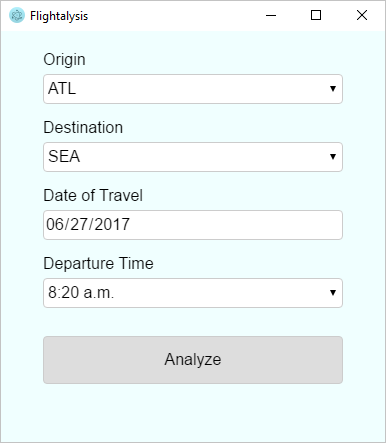
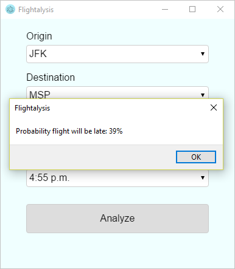

# Machine Learning Challenge

The purpose of the Machine Learning Challenge is to acquaint students with [Azure Machine Learning](https://azure.microsoft.com/services/machine-learning/?WT.mc_id=academiccontent-github-cxa) and [Machine Learning Studio](https://studio.azureml.net/), teach them how to build a basic machine-learning model, and put their data-science skills to work improving the model. The "challenge" is to get the model's accuracy to 75% or greater, up from the 58% accuracy it exhibits initially. Students are challenged to make the improvements themselves, but are provided with helpful hints to guide their way.

## Leading an Event

Here is a suggested itinerary if you are leading a Machine Learning Challenge event:

- Begin by using the Speakers slides (**Machine Learning Challenge.pptx**) to introduce students to machine learning
	 - In the first demo (slide 8), work Exercise 1 of the challenge and invite students to follow along with you
	 - In the second demo (slide 16), work Exercise 2 of the challenge and invite students to follow along with you
- When you reach slide 17 ("Take the challenge!"), turn it over to the students and invite them to open **Machine Learning Challenge.html** and work Exercise 3 on their own. Challenge them to build a better model *without* adding features to the model or changing the 80-20 split of training data and scoring data.
	- Give students an hour or more to work the challenge, and invite them to raise a hand when they improve the model's accuracy. Check out the work that they did and make sure it's "legal" — for example, that they didn't increase accuracy by introducing additional features to the model that positively bias the results.
	- JUDGING THE CHALLENGE: Enlist about 1 additional helper-judge per 30 or so students. Be sure to have each helper-judge go through the lab themselves using the various data science techniques. This helps ensure students get assistance when they need. In the 2nd half of the challenge, student teams will need to validate their score with a judge. Judges should check for obvious restrictions like deleting rows of data or using data that couldn't otherwise be inputted by a user (like ARR_DEL15,  DEP_DEL15, and DEP_DELAY) during the use case for prediction (that is, a person booking the flight weeks in advance doesn't know if the plane will be delayed...) Maintain a leaderboard at the front of the room that shows the highest AUC achieved to this point and use it to engender friendly competition among the students. Award prizes as desired. Note: Be sure to set a hard cut off time on when the challenge ends so that students understand when they can no longer enter a score. You should build-in time for judges to validate those scores.
- Once the challenge is complete, use slides 18-20 in the slide deck to introduce the concept of operationalizing a model by deploying it as a Web service
	- In the third demo (slide 21), run the Flightalysis app found in the "Client" folder of the Machine Learning Challenge. The next section explains how to configure it to run on your PC or laptop.
- Use slides 22-25 to introduce Microsoft Cognitive Services, positioning it as a cool set of APIs that utilize sophisticated machine-learning models built by researchers as Microsoft. There are also alternative slides in the Appendix originally used in the 2017 Imagine Cup version of the ML Challenge.

Finish up by recognizing the student who achieved the highest AUC, discussing some of the techniques he or she used to do it, and giving out prizes. Make it fun, because learning should always be fun! 

## Demoing the Flightalysis app

One of the strengths of Azure Machine Learning is that you can easily operationalize a model by deploying it as a Web service. Once a model is deployed in this manner, you can write client apps that leverage its intelligence by placing calls to the Web service's REST endpoint. Client apps can be written in Java, C#, JavaScript or just about any language you choose because REST calls travel over HTTP, and virtually all programming languages support HTTP.

The "Client" folder that accompanies the challenge contains a desktop app written with [Node.js](https://nodejs.org/) and [Electron](https://electron.atom.io/) that runs on Windows, macOS, and Linux, and that calls out to a Web service that has been predeployed from Azure ML Studio. Here's how to configure it and demo it.

1. Find the "Client" subdirectory that accompanies this challenge and open the file named **predict.js** in your favorite text or code editor. Replace *api_key* on line 2 with the following API key:

	```
	v0sYvtm/asoigzATDCMAA/2WqcGuYKpYAKqIdGZX1FCOSfQGMzKpDRvsoDt95plnZX6fWov+oUS06oxYnqFO3Q==
	```

1. In the same file, replace *web_service_url* on line 3 with the following URL:

	```
	https://ussouthcentral.services.azureml.net/workspaces/c03b81b3739c4999a4f627127308beaa/services/8a937f23c20a4d2b950ead93b46b5866/execute?api-version=2.0&details=true
	```

1. Open a Command Prompt window (Windows) or a Terminal window (macOS and Linux) and type the following command to determine whether Node.js is installed on your system:

	```
	node -v
	```

	If Node is not installed (if you don't see a Node version number), then go to https://nodejs.org/ and install the version of Node that matches your operating system.

1. In the Command Prompt or Terminal window, use a ```cd``` command to navigate to the "Client" directory accompanying this challenge. Then execute the following command:

	```
	npm install
	```

1. Wait the command to finish. Then type the following command to start the application:

	```
	npm start
	```

1. Confirm that the app starts and displays a window like this one:

    

    _The Flightalysis app_

1. Select an origin airport and a destination airport. Then select a date and a flight time and click the **Analyze** button. Confirm that after a brief pause, a message box appears indicating the probability that the flight will arrive late.

    

    _Predicting whether a flight will be late_

1. Experiment with different origins, destinations, dates, and departure times and see how the results vary. You will probably experience a greater probability of delays with flights that leave later in the day because earlier flights tend to run more on time.

Once the app is configured in this manner, you can run it again simply by executing an ```npm start``` command in the folder containing the source code files.
