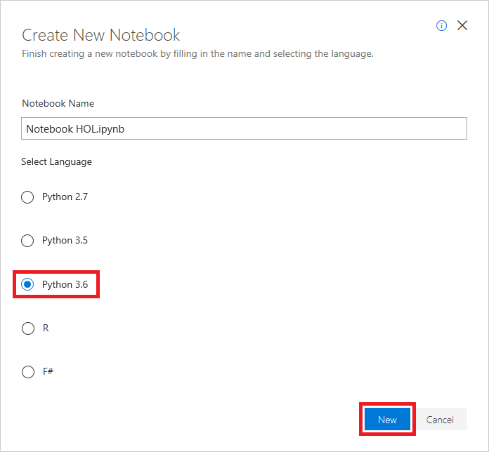
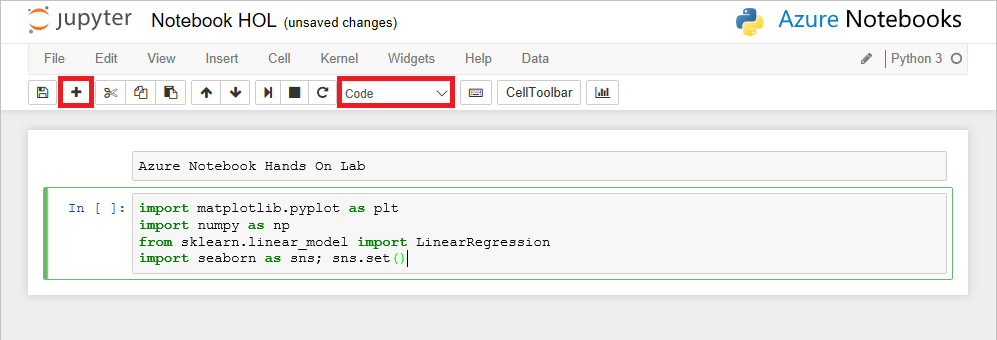
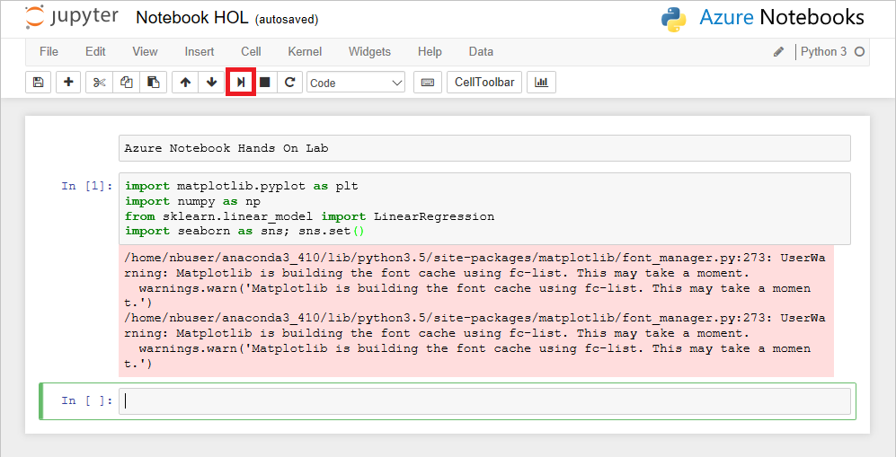
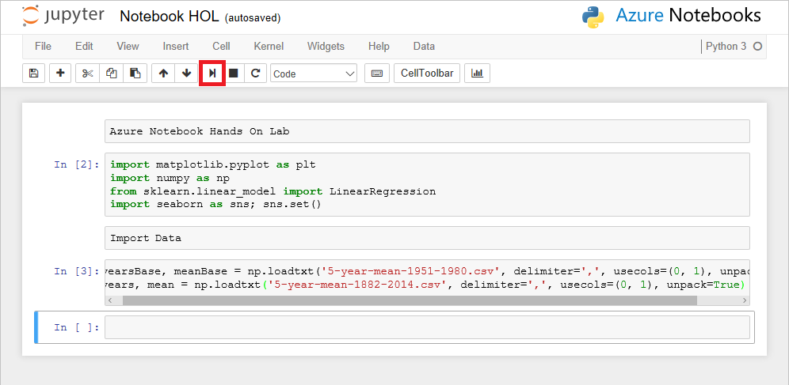
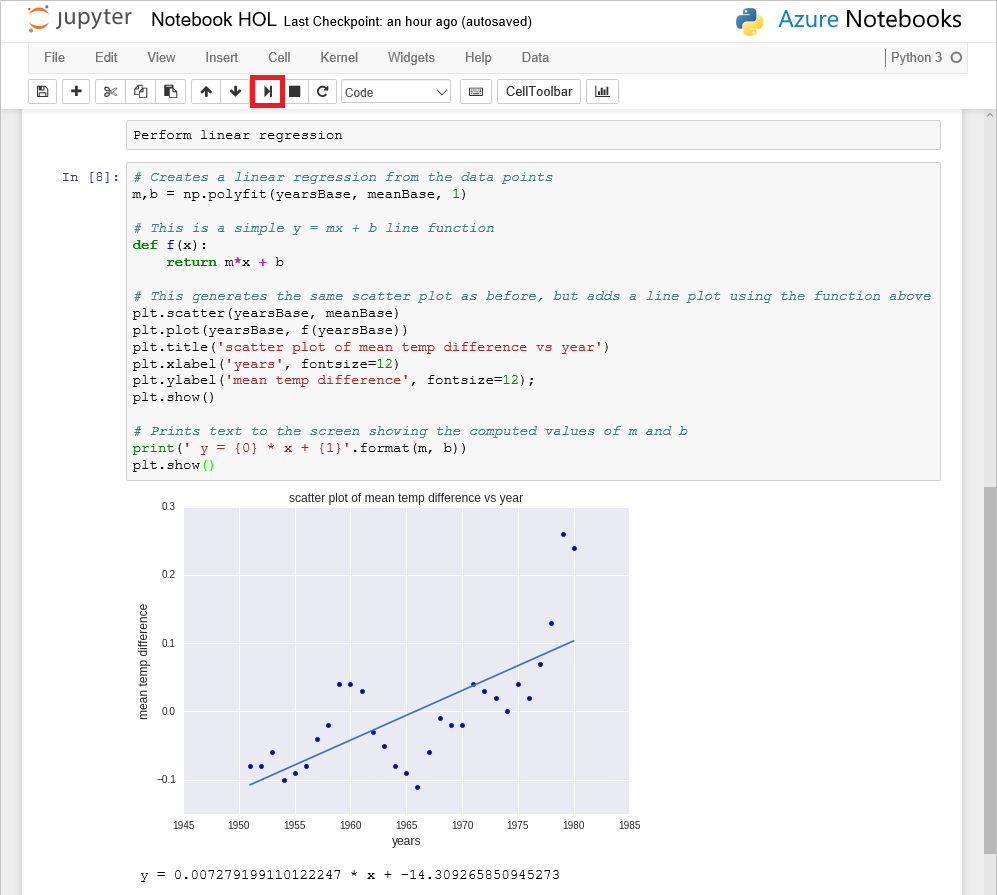

<a name="HOLTitle"></a>
# Building Jupyter Notebooks with Azure Notebooks #

[Azure Notebooks](https://notebooks.azure.com/?WT.mc_id=academiccontent-github-cxa) is a cloud-based platform for building and running [Jupyter](http://jupyter.org/) notebooks. Jupyter is an environment based on [IPython](https://ipython.org/) that facilitates interactive programming and data analysis using a variety of programming languages, including Python. Jupyter notebooks enjoy widespread use in research and academia for mathematical modeling, machine learning, statistical analysis, and for teaching and learning how to code.

Azure Notebooks provide Jupyter as a service for free. It's a convenient way to build notebooks and share them with others without having to install and manage a Jupyter server. And it's completely Web-based, making it an ideal solution for collaborating online. In this lab, you will create an Azure Notebook and use three popular Python libraries — [scikit-learn](http://scikit-learn.org/stable/index.html), [NumPy](http://www.numpy.org/), and [Seaborn](https://seaborn.pydata.org/) — to analyze climate data collected by NASA. Then you will create a slide show from the notebook and share the notebook so others can experiment with it, too.


<a name="Objectives"></a>
### Objectives ###

In this hands-on lab, you will learn how to:

- Create a notebook in Azure Notebooks
- Upload, manipulate, and visualize data in a notebook
- Create a slide show from a notebook
- Share notebooks online

<a name="Prerequisites"></a>
### Prerequisites ###

The following are required to complete this hands-on lab:

- An active Microsoft personal account. If you don't have one, [sign up for free](https://account.microsoft.com/account?WT.mc_id=academiccontent-github-cxa).
- A modern Web browser

<a name="Resources"></a>
### Resources ###

[Click here](https://a4r.blob.core.windows.net/public/notebook-resources.zip) to download a zip file containing the resources used in this lab. Copy the contents of the zip file into a folder on your hard disk.

<a name="Cost"></a>
### Cost ###


There is no cost associated with this lab because it doesn't require an Azure subscription. For an overview of cost ratings, refer to [Explanation of Costs](../../Costs.md).

<a name="Exercises"></a>
## Exercises ##

- [Exercise 1: Create a project and a notebook](#Exercise1)
- [Exercise 2: Upload data and create a scatter plot](#Exercise2)
- [Exercise 3: Perform linear regression with NumPy](#Exercise3)
- [Exercise 4: Perform linear regression with scikit-learn](#Exercise4)
- [Exercise 5: Analyze the data with Seaborn](#Exercise5)
- [Exercise 6: Create a slide show](#Exercise6)
- [Exercise 7: Share a notebook](#Exercise7)

Estimated time to complete this lab: **45** minutes.

<a name="Exercise1"></a>
## Exercise 1: Create a project and a notebook ##

The first order of business is to create a new Azure notebook. Azure notebooks are contained in projects, whose primary purpose is to group related notebooks. In this exercise, you will create a new project and then create a notebook inside it.

1. Navigate to https://notebooks.azure.com in your browser and sign in using your Microsoft account. Click **My Projects** in the menu at the top of the page. Then click the **+ New Project** button at the top of the "My Projects" page.

1. Create a new project named "Lab Notebooks" or something similar.

	

	_Creating a project_

1. Click **+ New** and select **Notebook** from the menu to add a notebook to the project.

	

	_Adding a notebook to the project_

1. Give the notebook a name such as "Notebook HOL.ipynb," and select **Python 3.6** as the language. This will create a notebook with a Python 3.6 kernel for executing Python code. One of the strengths of Azure notebooks is that you can use different languages by choosing different kernels.

	

	_Creating a notebook_

	If you're curious, the .ipynb file-name extension stands for "IPython notebook." Jupyter notebooks were originally known as IPython (Interactive Python) notebooks, and they only supported Python as a programming language. The name Jupyter is a combination of Julia, Python, and R — the core programming languages that Jupyter supports.

1. Click the notebook to open it for editing.

	

	_Opening the notebook_

You can create additional projects and notebooks as you work with Azure Notebooks. You can create notebooks from scratch, or you can upload existing notebooks. And once a notebook is created or uploaded, you can take advantage of Azure compute resources to run the notebook and leverage popular Python libraries such as [Keras](https://keras.io/), [NumPy](http://www.numpy.org/), [Pandas](https://pandas.pydata.org/), [Matplotlib](https://matplotlib.org/), and [Scikit-learn](https://scikit-learn.org/stable/index.html).

<a name="Exercise2"></a>
## Exercise 2: Upload data and create a scatter plot ##

Jupyter notebooks are composed of *cells*. Each cell is assigned one of four types:

- **Markdown** for entering text in [markdown](https://github.com/adam-p/markdown-here/wiki/Markdown-Cheatsheet) format
- **Code** for entering code that runs interactively
- **Raw NBConvert** for entering data inline
- **Heading** for section headers   

Code entered into code cells is executed by a *kernel*, which provides an isolated environment for the notebook to run in. The popular IPython kernel supports code written in Python, but [dozens of other kernels](https://github.com/jupyter/jupyter/wiki/Jupyter-kernels) are available supporting other languages. Azure Notebooks support Python, R, and F# out of the box. They also support the installation of the numerous packages and libraries that are commonly used in research.

The notebook editor currently shows an empty cell. In this exercise, you will add content to that cell and add other cells to import Python packages such as [NumPy](http://www.numpy.org/), load a pair of NASA data files containing [climate data](https://data.giss.nasa.gov/gistemp/graphs_v3/), and create a scatter plot from the data.

1. In the first cell, set the cell type to **Markdown** and enter the "Azure Notebook Hands On Lab" into the cell itself:

	

	_Defining a markdown cell_

1. Click the **+** button in the toolbar to add a new cell. Make sure the cell type is **Code**, and then enter the following Python code into the cell:

	```python
	import matplotlib.pyplot as plt
	import numpy as np
	from sklearn.linear_model import LinearRegression
	import seaborn as sns; sns.set()
	```

	

	_Adding a code cell_

1. Now click the **Run** button to run the code cell and import the packages specified in the ```import``` statements. Ignore any warnings that are displayed as the environment is prepared for the first time.

	> You can remove the warnings by selecting the code cell and running it again.

	

	_Running a code cell_

1. Click **Data** in the menu at the top of the page, and select **Upload** from the drop-down menu. Then upload the files named **5-year-mean-1951-1980.csv** and **5-year-mean-1882-2014.csv** from the [resources that accompany this lab](https://a4r.blob.core.windows.net/public/notebook-resources.zip).

	

	_Uploading data to the notebook_

1. Place the cursor in the empty cell at the bottom of the notebook. Enter "Import Data" as the text and change the cell type to **Markdown**.

1. Now add a **Code** cell and paste in the following code.

	```python
	yearsBase, meanBase = np.loadtxt('5-year-mean-1951-1980.csv', delimiter=',', usecols=(0, 1), unpack=True)
	years, mean = np.loadtxt('5-year-mean-1882-2014.csv', delimiter=',', usecols=(0, 1), unpack=True)
	```

1. Click the **Run** button to run the cell and use NumPy's ```loadtxt``` function to load the data that you uploaded. The data is now in memory and can be used by the application.

	

	_Loading the data_

1. Place the cursor in the empty cell at the bottom of the notebook. Change the cell type to **Markdown** and enter "Create a scatter plot" as the text.

1. Add a **Code** cell and paste in the following code, which uses [Matplotlib](http://matplotlib.org/) to create a scatter plot.

	```python
	plt.scatter(yearsBase, meanBase)
	plt.title('scatter plot of mean temp difference vs year')
	plt.xlabel('years', fontsize=12)
	plt.ylabel('mean temp difference', fontsize=12);
	plt.show()
	```

1. Click **Run** to run the cell and create a scatter plot.

	

	_Scatter plot produced by Matplotlib_

The data set that you loaded uses a 30-year mean between 1951 and 1980 to calculate a base temperature for that period, and then uses 5-year mean temperatures to calculate the difference between the 5-year mean and the 30-year mean for each year. The scatter plot shows the annual temperature differences.

<a name="Exercise3"></a>
## Exercise 3: Perform linear regression with NumPy ##

Scatter plots offer a handy means for visualizing data, but suppose you wanted to overlay the scatter plot with a trend line showing how the data is trending over time. One way to compute such trend lines is [linear regression](https://en.wikipedia.org/wiki/Linear_regression). In this exercise, you will use NumPy to perform a linear regression and Matplotlib to draw a trend line from the data.

1. Place the cursor in the empty cell at the bottom of the notebook. Change the cell type to **Markdown** and enter "Perform linear regression" as the text.

1. Add a **Code** cell and paste in the following code. Take a moment to read the comments (the lines that begin with # signs) to understand what the code is doing.

	```python
	# Creates a linear regression from the data points
	m,b = np.polyfit(yearsBase, meanBase, 1)

	# This is a simple y = mx + b line function
	def f(x):
        return m*x + b

	# This generates the same scatter plot as before, but adds a line plot using the function above
	plt.scatter(yearsBase, meanBase)
	plt.plot(yearsBase, f(yearsBase))
	plt.title('scatter plot of mean temp difference vs year')
	plt.xlabel('years', fontsize=12)
	plt.ylabel('mean temp difference', fontsize=12);
	plt.show()

	# Prints text to the screen showing the computed values of m and b
	print(' y = {0} * x + {1}'.format(m, b))
	plt.show()
	```

1. Now run the cell to display a scatter plot with a regression line.

	

	_Scatter plot with regression line_

From the regression line, you can see that the difference between 30-year mean temperatures and 5-year mean temperatures is increasing over time.  Most of the computational work required to generate the regression line was performed by NumPy's ```polyfit``` function, which computed the values of ```m``` and ```b``` in the equation y = mx + b. 

<a name="Exercise4"></a>
## Exercise 4: Perform linear regression with scikit-learn ##

Another popular Python library that is widely used in the research community is [scikit-learn](http://scikit-learn.org/stable/), which excels at building machine-learning models to help extract information from data. In this exercise, you will use scikit-learn (which was already imported in [Exercise 2](#Exercise2)) to compute a trend line for the NASA climate data.

1. Place the cursor in the empty cell at the bottom of the notebook. Change the cell type to **Markdown** and enter "Perform linear regression with scikit-learn" as the text.

1. Add a **Code** cell and paste in the following code.

	```python
	# Pick the Linear Regression model and instantiate it
	model = LinearRegression(fit_intercept=True)

	# Fit/build the model
	model.fit(yearsBase[:, np.newaxis], meanBase)
	mean_predicted = model.predict(yearsBase[:, np.newaxis])

	# Generate a plot like the one in the previous exercise 
	plt.scatter(yearsBase, meanBase)
	plt.plot(yearsBase, mean_predicted)
	plt.title('scatter plot of mean temp difference vs year')
	plt.xlabel('years', fontsize=12)
	plt.ylabel('mean temp difference', fontsize=12);
	plt.show()

	print(' y = {0} * x + {1}'.format(model.coef_[0], model.intercept_))
	```

1. Now run the cell to display a scatter plot with a regression line.

	

	_Scatter plot with regression line computed by sckikit-learn_

The output is almost identical to the output in the previous exercise. The difference is that scikit-learn did more of the work for you. Specifically, you didn't have to code a line function as you did with NumPy; scikit-learn's ```LinearRegression``` function did it for you. scikit-learn supports *many* different types of regression, which comes in handy when building sophisticated machine-learning models.

<a name="Exercise5"></a>
## Exercise 5: Analyze the data with Seaborn ##

One of the cool things about Azure Notebooks — and Python in general — is that there are thousands of open-source libraries you can leverage to perform complex tasks without writing a lot of code. In this exercise, you will use [Seaborn](https://seaborn.pydata.org/), a library for statistical visualization, to plot the second of the two data sets you loaded, which covers the years 1882 to 2014. Seaborn can create a regression line accompanied by a projection showing where data points should fall based on the regression with one simple function call.

1. Place the cursor in the empty cell at the bottom of the notebook. Change the cell type to **Markdown** and enter "Perform linear regression with Seaborn" as the text.

1. Add a **Code** cell and paste in the following code.

	```python
	plt.scatter(years, mean)
	plt.title('scatter plot of mean temp difference vs year')
	plt.xlabel('years', fontsize=12)
	plt.ylabel('mean temp difference', fontsize=12);
	sns.regplot(yearsBase, meanBase)
	plt.show()
	```

1. Run the code cell to produce a scatter chart with a regression line *and* a visual representation of the range in which the data points are expected to fall. 

	

	_Comparison of actual values and predicted values generated with Seaborn_

Notice how the how the data points for the first 100 years conform nicely to the predicted values, but the data points from roughly 1980 forward do not. It is models such as these that lead scientists to believe that climate change is accelerating.

<a name="Exercise6"></a>	
## Exercise 6: Create a slide show ##

What if you wanted to take a notebook you've created and use it in a presentation? You can use create slide shows from the cells in a notebook and play them back when it's presentation time. In this exercise, you will create a slide show from the notebook you built in the previous exercises.

1. Scroll up to the top of the notebook. Then select **View** -> **Cell Toolbar** -> **Slideshow**. This will display a **Slide Type** drop-down in each cell for specifying how individual cells behave during a slide show.

	

	_Toggling the Slide Type display_

1. Set the **Slide Type** for each markdown slide in the notebook to **Slide**. Set the **Slide Type** for each code cell to **Fragment**.

	

	_Specifying the slide type for individual cells_

1. Click the **Slideshow** button to play the slide show. 

	

	_Starting the slide show_

1. Maximize the browser window (or switch the browser to full-screen mode if your browser supports it). Then use the arrow buttons in the lower-right corner of the page (or the left and right arrows keys on the keyboard) to navigate backward and forward in the slide show.

	

	_Viewing the slide show_

1. When you're finished, click the **X** in the upper-left corner of the page to end the slide show.

Creating slide shows is easy. But what if you want to share a notebook with colleagues so they can use it, too? That is the subject of the next exercise.

<a name="Exercise7"></a>
## Exercise 7: Share a notebook ##

One of the value-added features of Azure Notebooks is that it provides a cloud-based hub for sharing notebooks. In this exercise, you will share the project containing the notebook that you created.

1. Select **File** -> **Close and Halt** to close the notebook.

	

	_Closing the notebook_

1. Click **Share**, and then select **Copy Link** from the drop-down menu.

	

	_Sharing by link_

1. Paste the link into a separate private or incognito browser window and confirm that the project appears there. Click the "Notebook HOL" notebook and confirm that you can open it and run it.

Another way to share a notebook is to download it as a .ipynb file and send the .ipynb file to whomever you wish to share it with.  Downloading .ipynb files is also useful for making local copies of your notebooks. You can even run them in other Jupyter environments if you would like because there is nothing proprietary about Azure Notebooks.

<a name="Summary"></a>
## Summary ##

The [Azure Notebooks Web site](https://notebooks.azure.com/?WT.mc_id=academiccontent-github-cxa) contains several sample notebooks that you can experiment with and learn from. [Discover Sentiments in Tweets](https://notebooks.azure.com/Microsoft/libraries/samples/html/Discover%20Sentiments%20in%20Tweets.ipynb?WT.mc_id=academiccontent-github-cxa) performs sentiment analysis on 160,000 tweets, and uses the [word_cloud](https://github.com/amueller/word_cloud) package to generate word clouds from the tweets. [Introduction to Cognitive Toolkit](https://notebooks.azure.com/cntk/libraries/tutorials?WT.mc_id=academiccontent-github-cxa) is a library of notebooks that demonstrate how to use the [Microsoft Cognitive Toolkit](https://www.microsoft.com/research/product/cognitive-toolkit/?WT.mc_id=academiccontent-github-cxa) to build sophisticated machine-learning models. Check out the Azure Notebooks home page for additional sample notebooks, and use them to deepen your understanding of Jupyter and sharpen your data-science skills.

---

Copyright 2018 Microsoft Corporation. All rights reserved. Except where otherwise noted, these materials are licensed under the terms of the MIT License. You may use them according to the license as is most appropriate for your project. The terms of this license can be found at https://opensource.org/licenses/MIT. 
